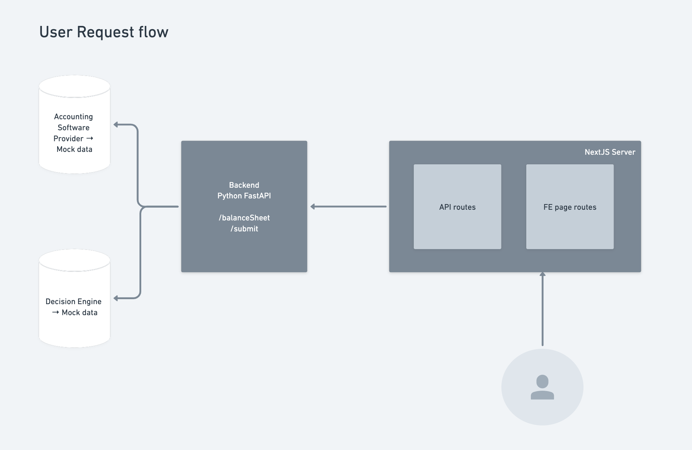

## Loan Application

Simple loan application that gets in user and business details and decides whether the required loan amount is approved or not. If Approved displays User the approved amount

## Tech Stack

### Frontend

- Typescript
- Next JS
- Tailwind CSS
- React Testing Library

### Backend

- Python
- FastAPI
- Pandas
- Pytest

## Assumption

- The accounting software and decision engine are already implemented. The backend uses mock data to simulate the response from these services.
- Balance sheet provider gives balance sheet in csv format
- Decision Engine approves Loan if `preAssessmentValue` is at-least 60% else the loan is not approved
- Decision Engine only grants 80% of the required loan amount

## Architecture



## Local Development

```bash

# Pre-requisite node >= 16 and yarn >= 1.22
cd frontend
yarn
yarn dev

# Pre-requisite python conda virtual env
cd gateway
make setup
make start

```

## Test

```bash

cd frontend
yarn test

cd backend
make test
```

## Build application using Docker

```bash
cd frontend
docker build -t loan-app-fe .

cd backend
docker build -t loan-app-be .
```

## Run the application using Docker compose

```bash
# Pre-requisite docker-compose
docker compose up -d

# Frontend app can be accessed at http:localhost:3000
# Backend app can be accessed at http:localhost:4000
```
